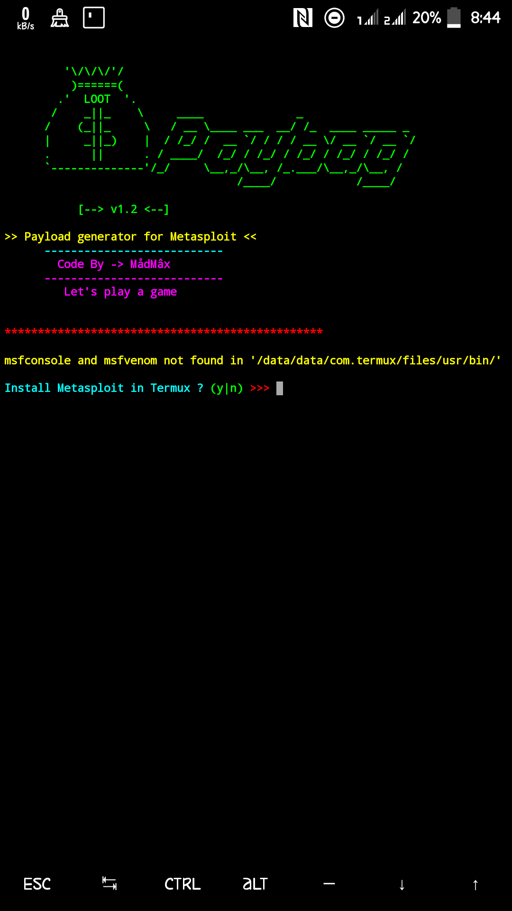

# Paybag

<p align="center">
<a href="https://github.com/HackWeiser360"></a>
<a href="https://github.com/HackWeiser360"></a>
<a href="https://github.com/HackWeiser360"></a>
<a href="https://github.com/HackWeiser360"></a>
<a href="https://github.com/HackWeiser360"></a>
<a href="https://github.com/HackWeiser360"></a>
<a href="https://github.com/HackWeiser360"></a>
</p>
This tool will create MetaSploit payloads for you. You don't need to create the payload yourself. Make sure you have installed MetaSploit. For the tool to work efficiently your MetaSploit should be in the latest version

## I won't be responsible for your shit
***
### [+] Installation and Usage
* $ apt update
* $ pkg install python
* $ pkg install git
* $ git clone
https://github.com/HackWeiser360/PayBag.git
* $ cd PayBag
* $ python3 PayBag.py 

If python3 does not work use:

* $ python PayBag.py

# Usage
**1) Create a payload**
- Create a payload by just giving LHOST and LPORT and send it to victim.

**2) Start Handler**
- After creating payload,send it to victim & execute it on victim machine.
- After execution,Select **'Start Handler'**,give LHOST and LPORT which used while creating payload.
- Now wait until a successfull connection.

**3) Launch Metasploit**
- Start Metasploit using **Launch Metasploit** option.

Now Enjoy
***
```
√ All PayLoads are stored in the 'payload' folder.

√ Tested on:Termux, Kali Linux, Ubuntu
```
### Tool created by MådMâx.
### Follow on Instagram:[madmax4708](https://www.instagram.com/madmax4708/).
### Follow on twitter:[503_madmax](https://twitter.com/503_madmax).


